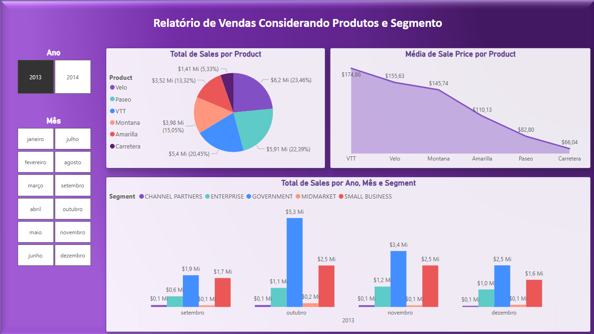
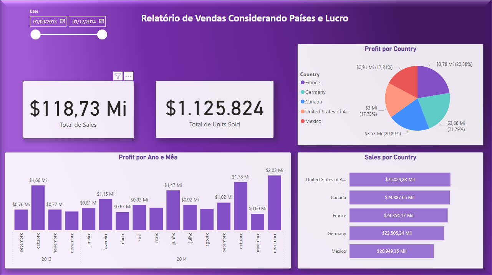

# Análise - Dashboard Financeiro

Este documento apresenta uma análise resumida do dashboard financeiro fornecido, cobrindo relatórios de vendas por produto e segmento, vendas e lucro por país, e distribuição de lucro por segmento.

## 1. Relatório de Vendas Considerando Produtos e Segmento

### Total de Vendas por Produto

O gráfico de pizza "Total de Vendas por Produto" mostra a distribuição das vendas entre diferentes produtos. O produto com maior contribuição é:

*   **Carretera**: $6.2 Mi (22.39%)

### Média de Preço de Venda por Produto

O gráfico de área "Média de Preço de Venda por Produto" indica a média de preço de venda para cada produto. O produto **VTT** apresenta a maior média de preço de venda, com $174.86, seguido por **Velo**. Os produtos **Paseo** e **Carretera** possuem as menores médias de preço.

### Total de Vendas por Ano, Mês e Segmento

O gráfico de barras "Total de Vendas por Ano, Mês e Segmento" detalha as vendas ao longo de 2013 e 2014. Observa-se um crescimento nas vendas em outubro e novembro de 2013, com destaque para o segmento **Government**.

  

## 2. Relatório de Vendas Considerando Países e Lucro

### Vendas e Unidades Vendidas

O dashboard apresenta:

*   **Total de Vendas**: $118.73 Mi
*   **Total de Unidades Vendidas**: $1.125.824

### Lucro por País

O gráfico de pizza "Lucro por País" mostra a distribuição do lucro por país. Os principais países em termos de lucro são:

*   **France**: (22,38%)
*   **Germany**: (21,79%)

### Lucro por Ano e Mês

O gráfico de barras "Lucro por Ano e Mês" ilustra a evolução do lucro ao longo de 2013 e 2014. Há uma variação mensal, com picos notáveis em outubro de 2013 ($1.66 Mi) e dezembro de 2014 ($2.03 Mi).

### Vendas por País

O gráfico de barras "Sales por Country" mostra o volume de vendas por país, com os **United States of America** liderando, seguido por **Canada**.

  

## 3. Distribuição de Lucro, Vendas e Unidades vendidas por país e segmento

### Soma de Profit por Segmento

O gráfico de pizza "Total Lucro por Segmento" e o gráfico de treemap abaixo mostram a distribuição do lucro por segmento. O segmento **GOVERNMENT** é o que mais contribui para o lucro, seguido por **SMALL BUSINESS**

  

 
## Conclusão

O dashboard fornece uma visão abrangente do desempenho financeiro, destacando a importância de produtos como Carretera, Montana e VTT, e a forte contribuição dos segmentos GOVERNMENT e SMALL BUSINESS para o lucro. Geograficamente, os Estados Unidos e a França são mercados chave tanto em vendas quanto em lucro.

