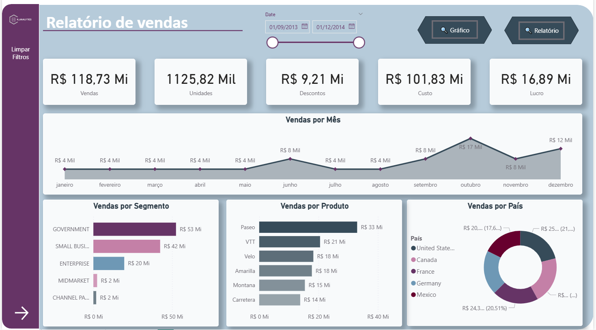
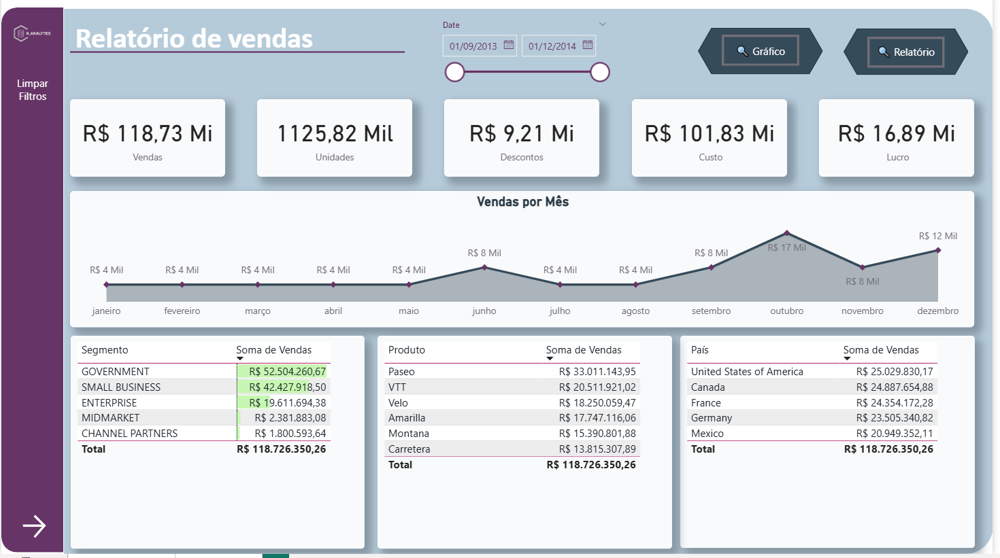
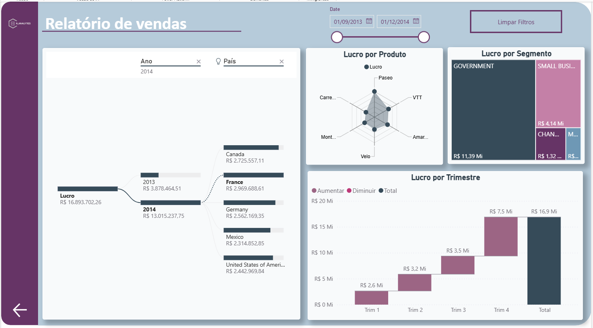

# 📊 Módulo 2 - Relatórios Interativos no Power BI

Este módulo apresenta dois painéis desenvolvidos no Power BI, com foco em **navegabilidade e interação visual** por meio de **botões e indicadores**.

---

## 🧭 Objetivo
Demonstrar como utilizar **botões de navegação e indicadores (bookmarks)** para alternar entre **gráficos e relatórios** dentro de uma mesma página do Power BI.

---

## 🪄 Funcionalidades Implementadas

- **Botões de Navegação:**
  - 🔘 **Gráfico** → Exibe os visuais de desempenho (barras e gráfico de pizza).
  - 🔘 **Relatório** → Mostra as tabelas detalhadas com os dados brutos.

- **Segmentadores e Filtros:**
  - Segmentação por **Data**, **País** e **Ano**.
  - Botão lateral para **Limpar Filtros**.

- **Indicadores (Bookmarks):**
  - Criados para alternar a exibição entre os dois conjuntos de visuais sem precisar trocar de página.

---

## 🧩 Estrutura Visual

### Painel 1 – Gráficos

### Painel 1.2 – Relatório

### Painel 3 – Lucro e Tendências

---

## 📁 Arquivos
| Tipo | Nome | Descrição |
|------|------|------------|
| `.pbix` | `sample_financial2.pbix` | Arquivo principal do Power BI |
| `.png` | `modulo2.1.PNG`, `modulo2.2.PNG`, `modulo2.1.1.PNG` | Imagens de referência dos painéis |
| `.md` | `Readme.md` | Documento explicativo deste módulo |

---

## 🚀 Tecnologias Utilizadas
- Power BI Desktop
- Dataset: *Financial Sample.xlsx*
- Bookmarks e botões com imagens personalizadas
- Filtros e segmentadores interativos

---

## 🧠 Aprendizado
Com este módulo, foi possível:
- Criar **experiências dinâmicas** com bookmarks e botões.
- Trabalhar com **design de navegação dentro do Power BI**.
- Otimizar o uso de **indicadores e segmentadores visuais**.

---

✍️ **Autora:** Naty  
📅 **Projeto:** Power BI Sample Financial Dashboard – Módulo 2